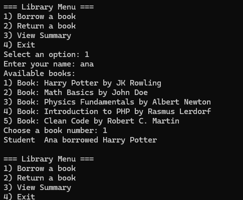
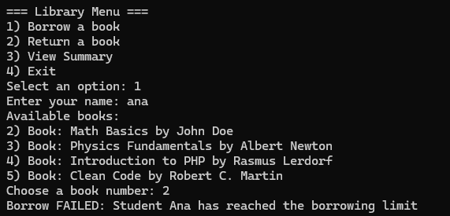
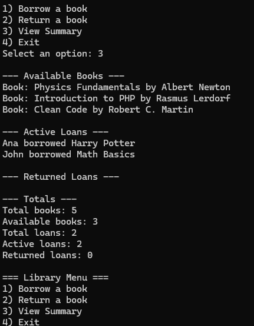

## HOW TO RUN
1: must have a php version PHP 8.4.16 (cli) (built: Dec 17 2025 10:31:49) (NTS Visual C++ 2022 x64)
Copyright (c) The PHP Group
Zend Engine v4.4.16, Copyright (c) Zend Technologies
    with Zend OPcache v8.4.16, Copyright (c), by Zend Technologie

2: open cmd

3: on cmd go to folder location

4: execute php index.php

note: there are only 2 user there. on the enter your name just enter "ana" for student and "John" for Regular

```bash
```
## OOP CONCEPT MAPPING

### ENCAPSULATION 
is implemented by making class properties private, such as $title and $author in Book, $name in Member, and $active in Loan, while providing controlled access through getters like __get(), getBook(), and getMember().

### ABSTRACTION
is demonstrated through the abstract Member class, which defines common properties and an abstract method getType() that must be implemented by all child classes, without specifying their exact behavior.

### INHERETANCE
is shown as StudentMember and RegularMember extend the Member class, reusing its properties and structure while adding specific borrowing behavior and type identification.

### POLYMORPHISM 
is used because Library interacts with any object that implements the Borrowable interface, allowing StudentMember and RegularMember to respond differently to BorrowBook() and ReturnBook() calls while the library code remains the same.

### COMPOSITION 
appears in Library, which manages Loan objects that link a specific Book with a specific Member, establishing a “has-a” relationship between Library and its loans.

### EXCEPTIONS 
are employed in Library to handle invalid operations, such as attempting to borrow a book when a member has reached their borrowing limit or returning a book that is not currently loaned, ensuring errors are caught and communicated properly.

```bash
```
## SAMPLE OUTPUt




